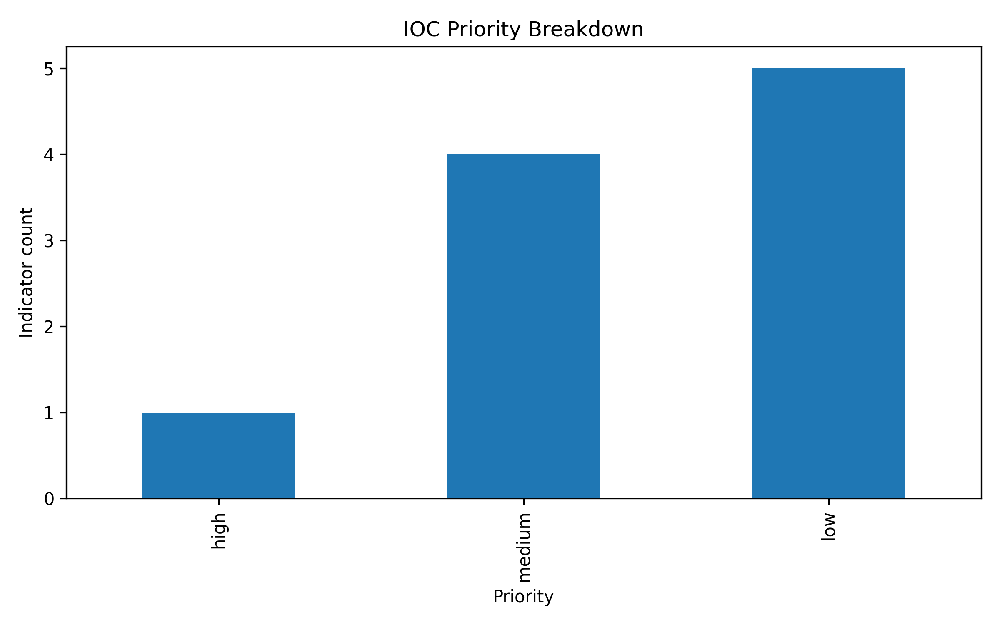

# IOC Triage for Threat Intelligence

## Executive Summary

This beginner-friendly threat intelligence project triages a small set of indicators of compromise, assigns risk scores, maps indicators to threat themes, and generates an analyst-style intelligence brief.

This is a realistic first project for a threat intelligence analyst because IOC triage is a common daily workflow: collect indicators, normalize them, enrich or score them, prioritize action, and communicate findings clearly.

## Analyst Question

> Which indicators should a security team prioritize for blocking, hunting, or further investigation?

## Data

The project uses a safe synthetic sample IOC list:

```text
data/raw/sample_iocs.csv
```

Indicator types include:

- IP addresses
- Domains
- URLs
- File hashes

## Method

The script applies transparent local scoring rules based on:

- indicator type
- suspicious phishing terms
- source telemetry type
- suspicious URL paths
- endpoint-observed hashes
- threat theme assignment

No paid API keys are required.

## Outputs

```text
data/processed/triaged_iocs.csv
reports/tables/triaged_iocs.csv
reports/tables/ioc_summary.csv
reports/figures/ioc_priority_breakdown.png
reports/writeup/ioc_triage_brief.md
```

## Key Visual



## How to Run

From the repository root:

```bash
source .venv/bin/activate
python projects/ioc_triage_threat_intel/src/ioc_triage.py
```

Or from a fresh environment:

```bash
python3 -m venv .venv
source .venv/bin/activate
pip install -r requirements.txt
python projects/ioc_triage_threat_intel/src/ioc_triage.py
```

## Why This Matters

Threat intelligence is only useful when it becomes prioritized action. This project shows how an analyst can turn raw IOCs into:

- triage decisions
- blocklist candidates
- SIEM hunt targets
- endpoint investigation leads
- a concise intelligence brief

## Next Improvements

Possible future upgrades:

- Add VirusTotal or AbuseIPDB enrichment
- Add WHOIS / domain age checks
- Add urlscan.io results
- Add confidence scoring
- Export SIEM watchlists
- Build a small Streamlit dashboard
